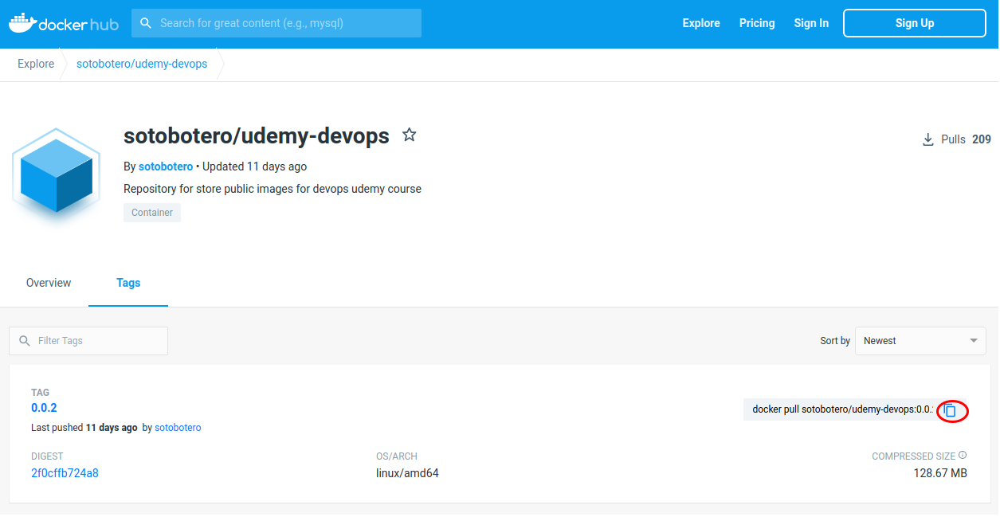

# Trabajando con Docker, imágenes y contenedores

  1. [Caso de estudio](#case)
  2. [Crear el contenedor para la app de facturación](#container)
  3. [Comandos de supervivencia](#docker-commands)
  4. [Docker Hub](#docker-hub)
  5. [Docker Compose: orquestar un servicio con dos imágenes](#docker-compose)
  6. [Crear una imagen personalizada con múltiples servicios](#create-image)
  7. [Subir una imagen personalizada a docker-hub](#upload-image)


<hr>

<a name="case"></a>

## 1. Caso de estudio

- Se requiere desplegar la aplicación de facturación de la compañía en los entornos de integración, preproducción y producción.
- La instalación debe contar alta disponibilidad en los entornos de preproducción y producción

**Requisitos técnicos**
- Java 1.8
- Servidor Web Nginx
- Base de datos Postgres

Si tuviésemos que implementar esta solución de forma tradicional, deberíamos replicar la instalación y configuración de Java, Nginx y Postgres en las 5 máquinas que darían el servicio para tener levantados los tres entornos. Además, si necesitamos escalar para mantener la disponibilidad, deberemos hacer lo mismo en cada una de las nuevas máquinas.


Este diagrama se simplifica mediante el uso de imágenes de docker, ya que sólamente hacemos la instalación y configuración de las herramientas necesarias una vez en el contenedor de docker. Luego este contenedor se utilizará en el **Docker Engine** en cada una de las máquinas que sea necesaria.


<hr>

<a name="container"></a>

## 2. Crear el contenedor para la app de facturación

Para realizar este proyecto vamos a utilizar la siguiente [imagen](https://hub.docker.com/r/sotobotero/udemy-devops/).

En la imagen tenemos por un lado un frontal que estará expuesto en el puerto 80 y un microservicio expuesto en el puerto 8080

En la pestaña tags podemos acceder el comando para descargarnos la imagen de este contenedor localmente:



Ejecutamos el contenedor a través del comando:

~~~
docker run -p 80:80 -p 8080:8080 --name billingapp sotobotero/udemy-devops:0.0.2
~~~

Una vez levantado el contenedor, podemos acceder al frontal de la imagen en ```localhost:80``` y al frontal disponible en el microservicio en ```localhost:8080/swagger-ui/index.html```.

<hr>

<a name="docker-commands"></a>

## 3. Comandos de supervivencia

- **Listar imágenes**
```docker image ls```

- **Elminar una imagen**
```docker image rm <imagen>```

- **Eliminar todas las imágenes**
```docker image rm $(docker image ls)```

- **Listar contenedores**
```docker ps -a```

- **Inicializar un contenedor**
```docker start <contenedor>```

- **Detener un contenedor**
```docker stop <contenedor>```

- **Eliminar un contenedor**
```docker container rm <contenedor>```

- **Eliminar todos los contenedores detenidos**
```docker rm $(docker ps -a -q)```

- **Visualizar los logs de un contenedor**
```docker logs <contenedor>```

- **Elminar un contenedor**
```docker rm <contenedor>```

<hr>

<a name="docker-hub"></a>

## 4. Docker Hub

Docker hub es un repositorio de imágenes accesible desde [https://hub.docker.com/](https://hub.docker.com/).

Las distintas plataformas disponibilizan imágenes oficiales de sus servicios para poder utilizarlas en nuestros proyectos.


<hr>

<a name="docker-compose"></a>

## 5. Docker Compose: orquestar un servicio con dos imágenes

Docker-compose permite permite simplificar el uso de Docker para crear contendores, conectarlos, habilitar puertos, volumenes, etc... a partir de archivos YAML.

Con Compose podemos crear diferentes contenedores y al mismo tiempo, en cada contenedor, diferentes servicios, unirlos a un volúmen común, iniciarlos y apagarlos, etc. Es un componente fundamental para poder construir aplicaciones y microservicios.

- Vamos a utilizar una imagen de Postgres. En docker-hub, en la información de la imagen oficial vemos que podemos descargarla con el comando...
~~~
docker pull postgres
~~~
- Para levantar el contenedor de forma local podemos utilizar el comando...
~~~
docker run --name some-postgres -e POSTGRES_PASSWORD=mysecretpassword -d postgres 
~~~

- O bien utilizar un archivo de configuración que le pasaremos a docker-compose:

~~~yaml
version: '3.1'

services:

  db:
  container_name: postgres
    image: postgres
    restart: always
    environment:
      POSTGRES_USER: postgres
      POSTGRES_PASSWORD: querty
      POSTGRES_DB: postgres
    ports:
      - 5432:5432

  adminer:
    container_name: adminer
    image: adminer
    restart: always
    depends_on:
      - db
    ports:
      - 9090:8080
~~~

> Como norma general, el archivo que utilizaremos para guardar esta configuración sera docker-compose.yaml. Si lo llamamos de otra forma (si tenemos varios archivos de configuración distintos), debemos especificarlo en la ejecución de docker-compose.

Para descargar las imágenes utilizamos el comando
~~~
docker-compose pull
~~~
o bien el siguiente comando si nuestra configuración está en un archivo de configuración con un nombre distinto:
~~~
docker-compose -f <nombre> pull
~~~

Para levantar los servicios asociados usaremos el comando:
~~~
docker-compose up -d
~~~
> -d permite levantar el contenedor en modo daemon.

Ahora en en navegador podemos navegar a ```localhost:9090``` para acceder a la interfaz de adminer que conecta con el motor de base de datos de postgres.

Para bajar los servicios que están levantados, podemos hacerlo uno a uno o bien a través del archivo de configuración mediante el comando:
~~~
docker-compose down
~~~

<hr>

<a name="create-image"></a>

## 6. Crear una imagen personalizada con múltiples servicios

Descargamos el zip que contendrá la app angular y el microservicio en java que utilizamos anteriormente y lo guardamos en la carpeta billingApp:
- En el directorio **dist** está la aplicación angular del frontal.
- En **target** tenemos el jar del microservicio que vamos a utilizar.
- El archivo **appshell.sh** es un script que levanta y el microservicio java y el servidor web.
- **nginx.conf** es la configuración por defecto del servidor web.

Creamos el *Dockerfile*:

- **FROM** indica la imagen de la que partimos
- **RUN** ejecuta comandos como si se invocaran desde la consola. Podemos separar un comando en varias líneas para que sea más legible usando **\\** al final de cada linea y **;** al final del comando.

~~~docker
FROM nginx:alpine

# Install java 8
RUN apk -U add openjdk8 \
    && rm -rf /var/cache/apk/*;
RUN apk add ttf-dejavu

# Install java microservice
ENV JAVA_OPTS=""
ARG JAR_FILE
ADD ${JAR_FILE} app.jar

# Install app on nginx serve
# Use a volume is more efficient and speed than filesystem
VOLUME /tmp
RUN rm -rf /usr/share/nginx/html/*
COPY nginx.conf /etc/nginx/nginx.conf
COPY dist/billingApp /usr/share/nginx/html
COPY appshell.sh appshell.sh

# Expose port 8080 for java swagger and port 80 for ngingx app
EXPOSE 80 8080
ENTRYPOINT ["sh", "/appshell.sh"]
~~~

Para construir la imagen utilizamos el comando:

~~~
docker build -t billingapp:prod --no-cache --build-arg JAR_FILE=target/*.jar .
~~~

- **-t** indica el nombre y la etiqueta que tendrá la imagen
- --**build-arg** establece el parámetro que hemos indicado en el Dockerfile.

Ahora podemos levantar un contenedor de esta imagen usando el comando: 
~~~
docker run -p 80:80 -p 8080:8080 --name billingapp billingapp:prod
~~~

<hr>

<a name="upload-image"></a>

## 7. Subir una imagen personalizada a docker-hub

- En la consola de docker-hub creamos un nuevo repositorio.

- En la terminal creamos una nueva imagen que apunte al repositorio remoto mediante el comando:
~~~
docker tag billingapp:prod abelalonso/billingapp:0.0.1
~~~
- Nos logueamos en docker-hub mediante el comando:
~~~
docker login
~~~
- Hacemos push de la imagen
{{{
  docker push abelalonso/billingapp:0.0.1
}}}